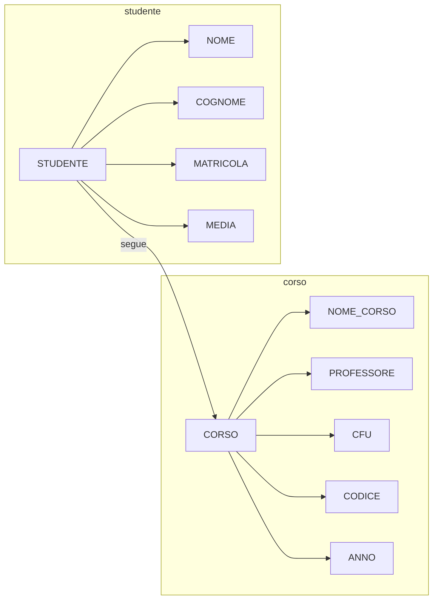

30/09/2022
## MODELLO A CASCATA
Suddivide il processo di progettazione di un qualsiasi software
- ==STUDIO DI FATTIBILITA==': bisogna determinare ==se un software è fattibile== (realizzabile in un determinato tempo o con determinate risorse)
- ==ANALISI DEI REQUISITI==: raccogliere tutti gli elementi necessari per poter ==capire il problema==
- ==PROGETTAZIONE==:
	- Progettazione ==concettuale==: tipologia di progettazione che utilizza un ==modello astratto== (svincolato dal tipo di implementazione) ==del database==
	- Progettazione ==logica==: non c'è ancora scrittura di codice, un modello astratto ==vicino alla struttura dati di interesse==
- ==IMPLEMENTAZIONE==: si scrive il software e le definizioni delle tabelle
- ==TESTING==: posso mettere a disposizione il database a dei beta-tester
- ==MESSA IN OPERA==: pubblicare il software

La cascata può essere risalita, ad esempio passare dalla fase di progettazione alla fase di analisi dei requisiti per fare interviste aggiuntive riguardo al problema
Le risalite sono fondamentali in quanto permettono di risparmiare tempo e soldi (bisogna cattuare il problema al livello più alto possibile)

![[Lezione 1 (P)#DATO|Definizione di dato]]
$\uparrow$ (Link a $\underline{Lezione~1(P)}$) $\uparrow$ 

## INCONSISTENZE IN UN DATABASE
Quando creiamo database, vogliamo evitare di creare più volte lo stesso dato (evitare duplicati per risparmiare spazio o errori, ad esempio di battitura)
Bisogna cercare di ==evitare le inconsistenze==.
Replicare dati porta con se il problema delle inconsistenze: avere dati unici

## MODELLO ER
Tra i modelli concettuali a disposizione, per i database useremo il modello ==Entity-Relationship== (ER)
Ci permette di gestire gli oggetti e le associazioni tra i vari oggetti.

$\uparrow$ **Non** è un diagramma ER, solo un esempio di astrazione $\uparrow$

Esistono 3 elementi di uno schema ER:
- ==Rettangono== rappresenta un'==entità==: oggetto di interesse
- ==Rombo== rappresenta un'==associazione==: relazione tra due entità
- ==Segmento con un pallino== per dire quali sono le ==proprietà delle entità== e delle relazioni
	- Per determinare l'attributo ==identificatore==, il pallino va ==riempito==

Es:
![[Img/ERD-Studente.png]]